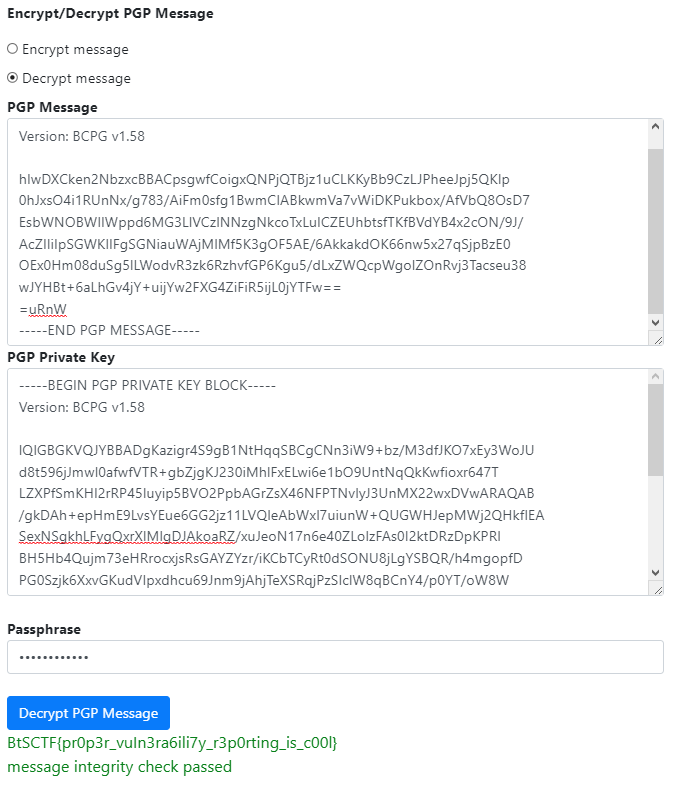

## Solution

1. Consider how you can send vulnerability disclosure, where to find e-mail adress dedicated to this? 
Visit ```security.txt``` file on ```whitehats.pwr.edu.pl/.well-known/security.txt```.

```
# Thank you for reaching us!
# Vulnerability disclosure can be fully reported with valid encrypted message with our PGP public key


Contact: mailto:kn.whitehats@pwr.edu.pl
Expires: 2022-07-31T02:55:00.000Z
Encryption: https://whitehats.pwr.edu.pl/pgp_key.txt
Preferred-Languages: en, pl
Canonical: https://whitehats.pwr.edu.pl/.well-known/security.txt

# Consider this message before you send to us vulnerability reporting!

-----BEGIN PGP MESSAGE-----

hIwDXCken2NbzxcBBACpsgwfCoigxQNPjQTBjz1uCLKKyBb9CzLJPheeJpj5QKIp
0hJxsO4i1RUnNx/g783/AiFm0sfg1BwmCIABkwmVa7vWiDKPukbox/AfVbQ8OsD7
EsbWNOBWlIWppd6MG3LlVCzlNNzgNkcoTxLuICZEUhbtsfTKfBVdYB4x2cON/9J/
AcZIIiIpSGWKlIFgSGNiauWAjMlMf5K3gOF5AE/6AkkakdOK66nw5x27qSjpBzE0
OEx0Hm08duSg5lLWodvR3zk6RzhvfGP6Kgu5/dLxZWQcpWgolZOnRvj3Tacseu38
wJYHBt+6aLhGv4jY+uijYw2FXG4ZiFiR5ijL0jYTFw==
=uRnW
-----END PGP MESSAGE-----

T29vcHNpZSEKT3VyIHByaXZhdGUgUEdQIGtleTogaHR0cHM6Ly93aGl0ZWhhdHMucHdyLmVkdS5wbC9wZ3BfcHJpdl9rZXkudHh0ClBhc3Njb2RlOiBzZWN1cml0eS50eHQ=
```
2. Read the encoded message in base64

```
T29vcHNpZSEKT3VyIHByaXZhdGUgUEdQIGtleTogaHR0cHM6Ly93aGl0ZWhhdHMucHdyLmVkdS5wbC9wZ3BfcHJpdl9rZXkudHh0ClBhc3Njb2RlOiBzZWN1cml0eS50eHQ=
```
```
Ooopsie!.Our private PGP key: https://whitehats.pwr.edu.pl/pgp_priv_key.txt.Passcode: security.txt
```

3. When you obtain access to public and private PGP key you can decrypt initial PGP message in ```security.txt``` file.

https://8gwifi.org/pgpencdec.jsp 

Online or offline.


