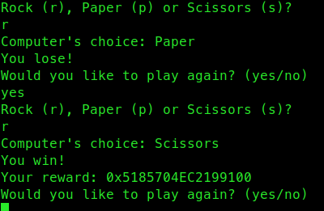
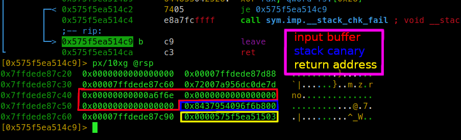

# Solution

## Vulnerabilities

- Reward for winning rock paper scissors game is stack canary leak
- Buffer overflow in start_game()

## Exploit

The goal will be to overflow return address with address of flag().  
We do not know address of flag() and value of stack canary.

### Leaking stack canary

[We try to guess correct answer, if we do program will leak stack canary,  
otherwise we say that we want to play again.](https://github.com/PWrWhiteHats/BtS-2022-Challenges/blob/pwn/rock-paper-scissors/chal/pwn/rock-paper-scissors/solution/solve.py#L9-L20)  



### overwriting return address

We build and send payload:  
```
payload = b"A"\*0x18        +   p64(reward)   +   b"A"\*8    +   p16(0x77aa)
          "A" * buffer size +   stack canary  +   saved rbp  +   overwrite two bytes of return address
                                                                 with guessed address of flag()
r.sendafter(b"(yes/no)\n",payload)
```


We do not know full address of flag(), but we can overwrite 12 least significant bits of return address  
that are not affected by ASLR/PIE, guess next 4 bits that are affected and the remaining 48 most significant  
bits of flag() address are the same as 48 most significant bits of return address.  

Chance of receiving the flag is 1/16 so we will have to try few times.

[solve.py](solve.py)
