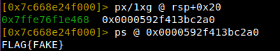
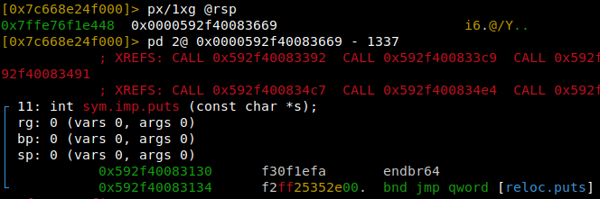

# Solution

Challenge binary overwrites instructions: syscall, int 0x80, sysenter with nops.  
  
  
We will call puts@plt with first argument being the pointer to flag.  
To find offsets we use debugger  
- pointer to flag - is at address rsp+20  

- puts@plt - we store value at rsp in rax, then substract 1337  

- last step is to `call rax` and receive the flag  
- `ret` to exit cleanly (not necessary)  
```asm
mov rdi, [rsp+0x20]
mov rax, [rsp]
sub rax, 1337
call rax
ret
```

[solve.py](solve.py)
