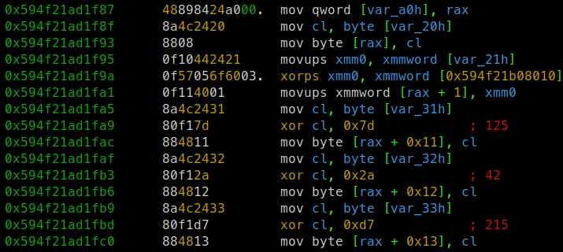
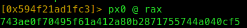
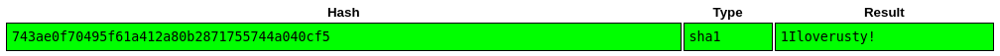

# Solution

Program compares sha1 hash of input with hash of password which is decrypted at runtime.  

## Approach

hash of password is decryped at runtime and stored in memory

we can retrive hash by reading it from memory after it's unxored 

and crack it using hashcat or [https://crackstation.net/](https://crackstation.net/)

Flag is `BtSCTF{1Iloverusty!}`.
