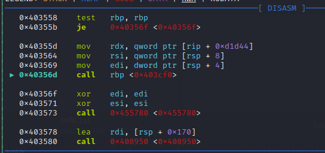
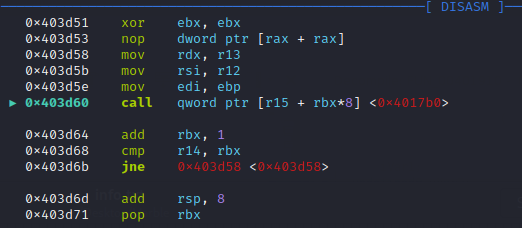
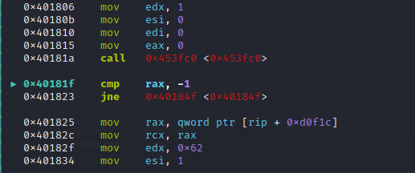
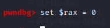
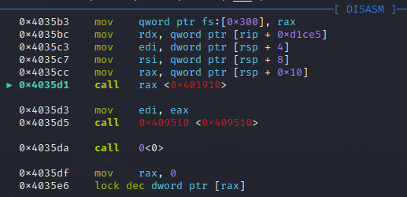
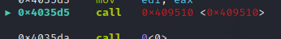
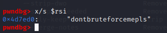

# Solution

Program needs correct password to display a flag, althought i tried to make static analysis a bit harder so i believe the simpler way to solve it is by using dynamic analysis like gdb.


## Approach

Program is packed with upx, so first after analysis with strings for example you will see that there is UPX at start. That should give a hint to unpack it.
```
upx -d warmup
```
when analyzing we can see that there is a simple anti-debugging trick with ptrace. Symbols are stripped so we have to find it manually. It can be found just going through code.



We then have to go deeper in function that executes before main.



After analysis we can simply change RAX register that is compared. You can also patch binary or delete exit function after.





Then in main function we find a call that ask for input. It is probably scanf of course.



Shortly after there is a call for comparision. A function after analysis should reveal the correct plaintext password that is already xored.



After that we can just analyse what is sent to function. That will reveal the correct password.



Just type in password and there is a flag in console.
